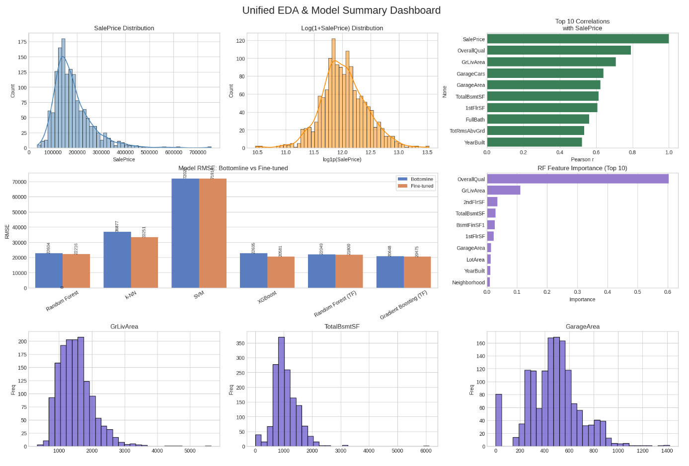

# House Price Prediction

Built predictive bottomline and fine tuned models to predict house prices using the Ames housing dataset from Kaggle's House Prices competition.
Link: https://www.kaggle.com/competitions/house-prices-advanced-regression-techniques/overview

## What was done

- Cleaned the dataset: imputed missing numeric values with the mean and categorical values with the mode.

- Encoded 40 + categorical fields with label-encoding.

- Split the data into training and validation folds (80 / 20).

- Trained bottomline and fine-tuned Random Forest, K-Nearest Neighbor, Support Vector Machine and Gradient Boosting Regressors.

- Wrote an RMSE helper and corrected a variable-naming bug that had masked model performance.

- Added fully documented code for all models (RF, k-NN, SVM and XGBoost).

## The Data

This dataset has 79 features describing houses. Fields like square footage, number of bedrooms, neighborhood, condition ratings, garage size, etc. Pretty comprehensive for house characteristics.

Training set: 1,460 houses  
Test set: 1,459 houses

## Files

- `train.csv` - training data with house prices
- `test.csv` - test data without prices (for predictions)
- `data_description.txt` - explains what each feature means
- Main analysis code in the notebook

## Results

- XGBoost Fine-tuned: ~20,221 RMSE
- XGBoost is expected to improve on this once hyper-parameters are tuned.

